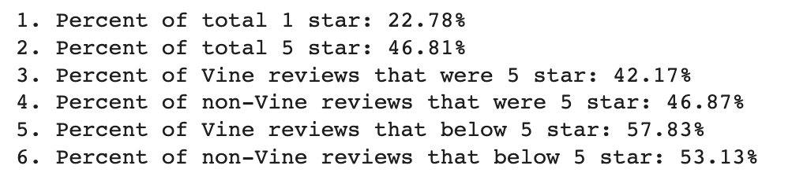

# Amazon Vine Analysis

## Overview:
This project is analyzing Amazon reviews written by members of the paid Amazon Vine program. The Amazon Vine program is a service that allows manufacturers and publishers to receive reviews for their products. Companies like SellBy pay a small fee to Amazon and provide products to Amazon Vine members, who are then required to publish a review.

In this project, we’ll have access to approximately 50 datasets. Each one contains reviews of a specific product, from clothing apparel to wireless products. You’ll need to pick one of these datasets and use PySpark to perform the ETL process to extract the dataset, transform the data, connect to an AWS RDS instance, and load the transformed data into pgAdmin. 

  - [Amazon Review datasets](https://s3.amazonaws.com/amazon-reviews-pds/tsv/index.txt)

In this project, we will do analysis on the products under Kitchen category. 

## Results:

The 5 star reviews takes 46.81% which is almost half and 1 star reviews take up 22.78%. We can conclude that approximately half customers are satisfied the products which is good sign but there is still some room to improve.

  | Kitchen product reviews | Total Reviews |
  |-------------------------|---------------|
  | Total reviews           | 99,046        |   
  | 1 star                  | 22,561        |  
  | 5 star                  | 46,367        | 
  | Below 5 star            | 52,679        | 

## Summary:

- The summary states whether or not there is bias, and the results support this statement :
  - Per the analysis above, looks like there are slightly bias that the total 5-star reviews were showing 46.81% while Vine 5 star reviews shows 42.17% . 
  
- An additional analysis is recommended to support the statement :
   - There are more than 20% of 1 star reviews which is too high for the products and the total below 5 star reviews take up around 54%. We would suggest the online stores to provide better products and well services after the selling as well.
   - The non-vine reviews take almost 99% while the vine reviews are only 1%.
  
  
  | Vine Reviews | Non-Vine Reviews |
  |--------------|------------------|
  | 1,207        | 97,839           |   
  | 1.22%        | 98.78%           | 
